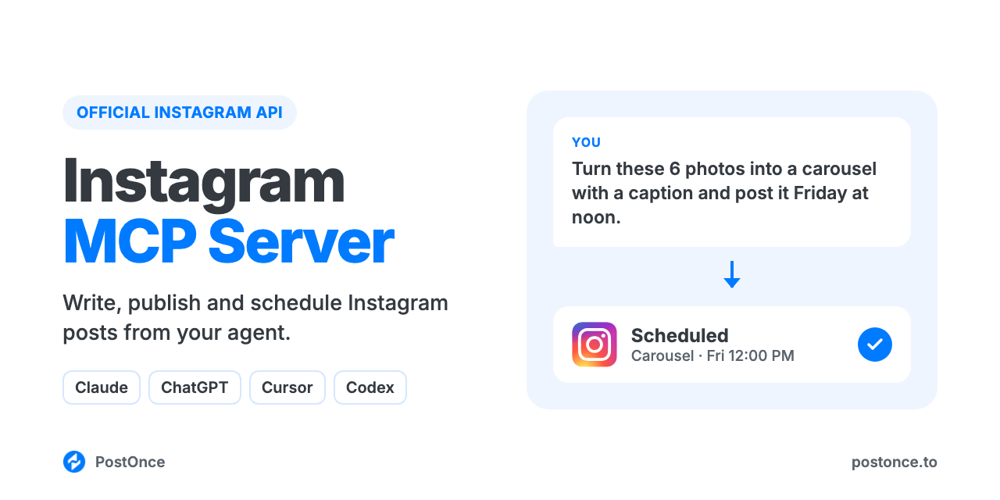

<p align="center"></p>

# Instagram MCP Server

Instagram MCP server for Claude, ChatGPT, Cursor and Codex. Your AI agent can write, publish and schedule Instagram photo posts, carousels and Reels on your Business or Creator account through Instagram's official API. There's no scraping, no browser automation and no Instagram developer app to set up.

It runs on [PostOnce](https://postonce.to)'s hosted MCP server and comes with Instagram skills for captions, carousels, Reel scripts, bios, hashtags and content calendars, so your agent knows what works on Instagram before it posts.

```
You:    Turn these 6 photos from the launch into a carousel with a caption
        and post it Friday at noon.
Claude: Wrote the caption with the instagram-caption-generator skill: hook on
        line one, 4 hashtags at the end. Scheduled on PostOnce for Fri 12:00 PM
        on @acme. Alt text for each photo is below; add it in the app once
        the post is live.
```

Full setup guide with examples: [postonce.to/mcp/instagram](https://postonce.to/mcp/instagram)

## What you can do

| Ask your agent to | How it works |
| --- | --- |
| Publish a photo post now | `create_post` with one image on your connected Instagram account |
| Post a carousel (2 to 10 photos or videos, mixed) | `create_upload_url`, upload each file, then `create_post` with `media` in order |
| Post a Reel (3 seconds to 15 minutes) with a custom cover | `create_post` with one video; `thumbnail_url` sets the cover |
| Schedule any of these for later | `create_post` with `publish_at` |
| Label a post as AI-generated | `platform_options: {"ai_generated": true}` |
| Save a draft to finish later | `create_draft` |
| Check whether a post went out, and get its URL | `get_post` |
| Change or cancel a scheduled post | `update_post`, `cancel_post` |
| Post the same thing to Instagram and other platforms | Add more targets to `create_post` (TikTok, YouTube, Facebook, LinkedIn, X, Threads, Pinterest, Bluesky) |

Captions go up to 2,200 characters. Images are published as JPEG, up to 8 MB, between 4:5 portrait and 1.91:1 landscape.

Not supported: Stories, text-only posts, collaborators, user tags, location, alt text, first comments, analytics, reading or replying to comments, DMs, and editing or deleting posts that are already live. This server publishes; it doesn't browse Instagram for you.

## Setup (about a minute)

You need a [PostOnce account](https://postonce.to) (free for 7 days, no card) with your Instagram Business or Creator account connected. Personal accounts can't publish through Instagram's API; switching to a professional account is free in the Instagram app.

**Claude (claude.ai and desktop) and ChatGPT:** add a custom connector with the URL below and sign in with PostOnce. No API key.

```
https://postonce.to/mcp
```

Step-by-step: [Claude](https://postonce.to/integrations/claude) · [ChatGPT](https://postonce.to/integrations/chatgpt)

**Claude Code, Codex and Cursor:** install the plugin. It adds the MCP connection and the skills together. Claude Code asks you to sign in to PostOnce the first time you use it (or run `/mcp` and pick postonce), so there's no key to copy. In Codex and Cursor, create an API key in [PostOnce preferences](https://postonce.to/dashboard/preferences) and give it to your client as the `POSTONCE_API_KEY` environment variable. Never paste the key into chat.

```bash
# Claude Code
claude plugin marketplace add postoncehq/plugins
claude plugin install instagram-mcp@postoncehq
```

Step-by-step: [Claude Code](https://postonce.to/integrations/claude-code) · [Codex](https://postonce.to/integrations/codex) · [Cursor](https://postonce.to/integrations/cursor)

**Any other MCP client:** point it at `https://postonce.to/mcp` (Streamable HTTP) with the header `Authorization: Bearer <your PostOnce API key>`.

## Skills included

| Skill | What it does |
| --- | --- |
| [`instagram-caption-generator`](skills/instagram-caption-generator/SKILL.md) | Writes feed, Reel and carousel captions: a first line that earns the "more" tap, a clear CTA, 3 to 5 hashtags, and alt text for you to add in the app. |
| [`instagram-carousel-maker`](skills/instagram-carousel-maker/SKILL.md) | Plans and builds a 2 to 10 slide carousel at 1080×1350, with the caption, ready to upload and post. |
| [`instagram-reel-script`](skills/instagram-reel-script/SKILL.md) | Writes a Reel script: hook options, beats, on-screen text, cover text and the caption. |
| [`instagram-bio-generator`](skills/instagram-bio-generator/SKILL.md) | Writes 150-character bio options and a searchable name field for you to paste into Instagram. |
| [`instagram-hashtag-generator`](skills/instagram-hashtag-generator/SKILL.md) | Picks a small set of specific hashtags for one post, instead of a wall of 30. |
| [`instagram-content-calendar`](skills/instagram-content-calendar/SKILL.md) | Plans 1 to 4 weeks of posts, carousels and Reels from your goals or a source you want to repurpose, then schedules them. |
| [`postonce`](skills/postonce/SKILL.md) | Publishing workflow: pick the right account, upload media, schedule, and confirm the post actually went live. |

## FAQ

**Does Instagram have an official MCP server?**
This server uses Instagram's official API through PostOnce. You connect your account once with Instagram's own login, and your agent publishes through that connection.

**Can Claude post to Instagram?**
Yes, once it's connected to an MCP server that can publish, like this one. Claude writes the caption, uploads your photos or video, then calls `create_post`.

**Is it safe for my Instagram account?**
Yes. Posts go through Instagram's official API with the permissions you grant when you connect. Many Instagram MCP servers on GitHub drive a logged-in browser session or an unofficial, reverse-engineered API instead, which Instagram's Terms of Use don't allow and which can get accounts restricted.

**Can it post Reels and carousels?**
Yes. One video publishes as a Reel (3 seconds to 15 minutes, up to 1 GB), and you can set its cover image. Carousels take 2 to 10 photos or videos, mixed; carousel videos must be 3 to 60 seconds.

**Can it post Instagram Stories?**
No. Stories can't be published through this server. Feed posts, carousels and Reels can.

**Do I need an Instagram developer app or API approval?**
No. PostOnce holds the Instagram API access; you just connect your Business or Creator account.

**Is it free?**
The skills and this repo are free and MIT-licensed. Publishing runs through a PostOnce account, which you can try free for 7 days without entering a card. After that, see [pricing](https://postonce.to/pricing).

## Data and privacy

- The posts, captions and media you ask your agent to publish are sent to PostOnce and on to the platforms you choose. Nothing is published without a request from you.
- Media files you upload go straight to PostOnce's file storage through a short-lived signed upload link, then publish from there. Uploaded media is publicly reachable so the platforms can fetch it.
- PostOnce stores your posts, media and connected account names so it can schedule them and show your publishing history. You can disconnect accounts and revoke access at any time in [PostOnce preferences](https://postonce.to/dashboard/preferences).
- The skills themselves run in your agent and send nothing anywhere else.

Full details: [privacy policy](https://postonce.to/privacy-policy) · [terms](https://postonce.to/tos).

## Other platforms

The same connection posts everywhere PostOnce supports. Platform repos with their own skills:
[LinkedIn MCP](https://github.com/postoncehq/linkedin-mcp) · [TikTok MCP](https://github.com/postoncehq/tiktok-mcp) · [YouTube MCP](https://github.com/postoncehq/youtube-mcp) · [Facebook MCP](https://github.com/postoncehq/facebook-mcp) · [X (Twitter) MCP](https://github.com/postoncehq/x-mcp) · [Threads MCP](https://github.com/postoncehq/threads-mcp) · [Bluesky MCP](https://github.com/postoncehq/bluesky-mcp) · [Pinterest MCP](https://github.com/postoncehq/pinterest-mcp)

## License

MIT. See [LICENSE](LICENSE).
